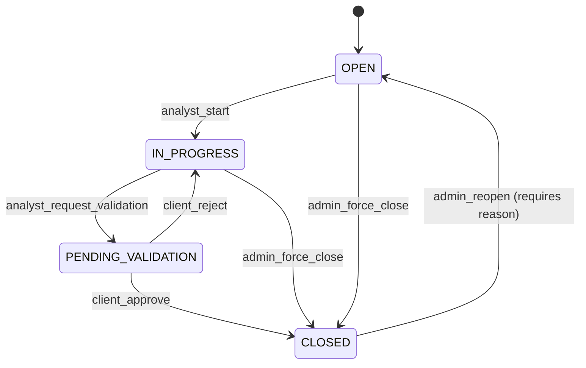

# QA Estados y Transiciones - ShieldTrack
**Fecha:** 21 de diciembre de 2025  
**Análisis:** Validación de máquina de estados de hallazgos

---

## 📊 ESTADOS ACTUALES (Promp.txt + Enums)

### Finding Status (common/enums.ts)
```typescript
export enum FindingStatus {
  OPEN = 'OPEN',
  IN_PROGRESS = 'IN_PROGRESS',
  PENDING_VALIDATION = 'PENDING_VALIDATION',
  CLOSED = 'CLOSED'
}

export enum CloseReason {
  FIXED = 'FIXED',
  RISK_ACCEPTED = 'RISK_ACCEPTED',
  FALSE_POSITIVE = 'FALSE_POSITIVE',
  CONTRACT_ENDED = 'CONTRACT_ENDED',
  OUT_OF_SCOPE = 'OUT_OF_SCOPE',
  DUPLICATE = 'DUPLICATE'
}
```

---

## 🚨 TRANSICIONES NO VALIDADAS

### ❌ PROBLEMA: Sin Guards de Transición
```typescript
// ❌ CÓDIGO ACTUAL (finding.service.ts línea 145-175)
async update(id: string, dto: UpdateFindingDto): Promise<Finding> {
  Object.assign(finding, dto); // ⚠️ Cualquier cambio de status permitido
  await finding.save();
}
```

**TRANSICIONES INVÁLIDAS PERMITIDAS:**
- OPEN → CLOSED directamente (❌ debería pasar por IN_PROGRESS)
- CLOSED → OPEN sin validación (❌ reapertura sin motivo)
- PENDING_VALIDATION → IN_PROGRESS (❌ retroceso sin justificación)

---

## ✅ MÁQUINA DE ESTADOS CORRECTA



### Roles por Transición
| From | To | Roles Permitidos | Validación Adicional |
|------|-----|-----------------|---------------------|
| OPEN | IN_PROGRESS | ANALYST, ADMIN | - |
| IN_PROGRESS | PENDING_VALIDATION | ANALYST | Debe tener evidencia |
| PENDING_VALIDATION | CLOSED | CLIENT_ADMIN, OWNER | Requiere closeReason |
| PENDING_VALIDATION | IN_PROGRESS | CLIENT_ADMIN | Requiere comment |
| * | CLOSED | OWNER, PLATFORM_ADMIN | Force close con reason |
| CLOSED | OPEN | OWNER, PLATFORM_ADMIN | Requiere reopenReason |

---

## 🧪 CASOS DE PRUEBA

### TC-EST-001: Transición Inválida debe Fallar
```typescript
it('❌ OPEN → CLOSED directamente debe rechazarse (ANALYST)', async () => {
  const finding = await createFinding({ status: 'OPEN' });
  const analyst = await createUser({ role: 'ANALYST' });

  const response = await findingService.update(
    finding.id,
    { status: 'CLOSED', closeReason: 'FIXED' },
    analyst.id
  );

  expect(response).rejects.toThrow('Transición inválida: OPEN → CLOSED (debe pasar por IN_PROGRESS)');
});
```

### TC-EST-002: Reapertura Sin Motivo
```typescript
it('❌ Reapertura CLOSED → OPEN sin reopenReason debe fallar', async () => {
  const finding = await createFinding({ status: 'CLOSED' });

  const response = await findingService.update(
    finding.id,
    { status: 'OPEN' } // ⚠️ Sin reopenReason
  );

  expect(response).rejects.toThrow('Reapertura requiere motivo (reopenReason)');
});
```

---

## ✅ IMPLEMENTACIÓN REQUERIDA

```typescript
// finding.service.ts
private validateTransition(
  currentStatus: FindingStatus,
  newStatus: FindingStatus,
  role: string,
  dto: any
): void {
  const validTransitions = {
    OPEN: ['IN_PROGRESS', 'CLOSED'], // CLOSED solo ADMIN
    IN_PROGRESS: ['PENDING_VALIDATION', 'CLOSED'],
    PENDING_VALIDATION: ['CLOSED', 'IN_PROGRESS'],
    CLOSED: ['OPEN'] // Solo ADMIN con reopenReason
  };

  if (!validTransitions[currentStatus]?.includes(newStatus)) {
    throw new BadRequestException(`Transición inválida: ${currentStatus} → ${newStatus}`);
  }

  // Validaciones específicas
  if (currentStatus === 'OPEN' && newStatus === 'CLOSED') {
    if (!['OWNER', 'PLATFORM_ADMIN'].includes(role)) {
      throw new ForbiddenException('Solo admins pueden cerrar directamente desde OPEN');
    }
  }

  if (currentStatus === 'CLOSED' && newStatus === 'OPEN') {
    if (!dto.reopenReason) {
      throw new BadRequestException('Reapertura requiere motivo');
    }
  }
}
```

---

## 🎯 PLAN

### Fase 1 (2 días) 🔴
- [ ] Implementar validateTransition()
- [ ] Agregar reopenReason a UpdateFindingDto
- [ ] Tests (10 casos)

---

## ✅ CONCLUSIÓN

**ESTADO:** ❌ Sin validación de transiciones  
**Prioridad:** 🔴 CRÍTICA (integridad de datos)  
**Estimación:** 2-3 días
